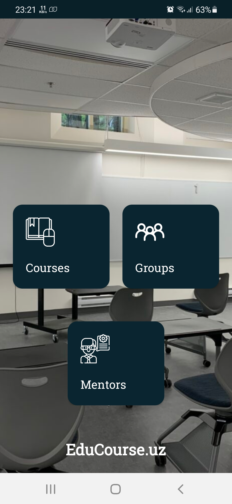
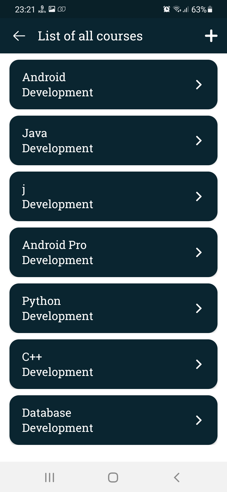
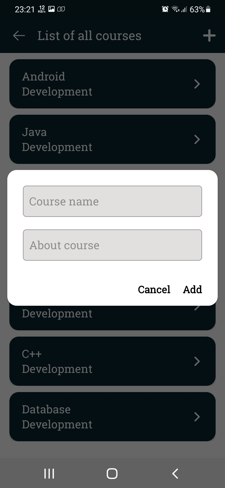
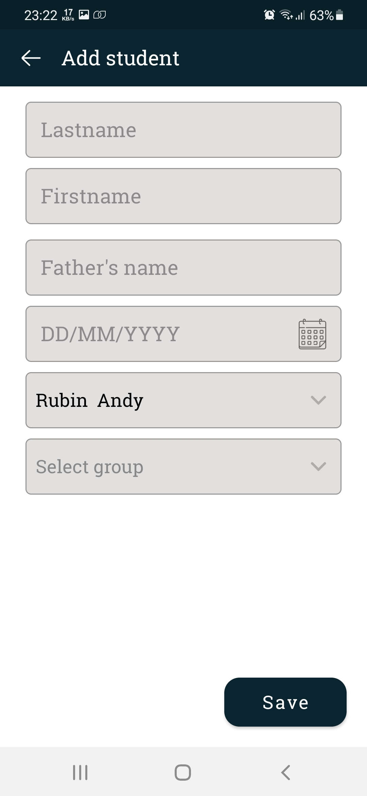
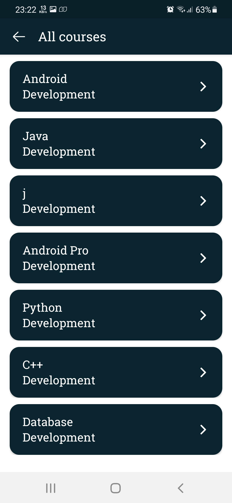
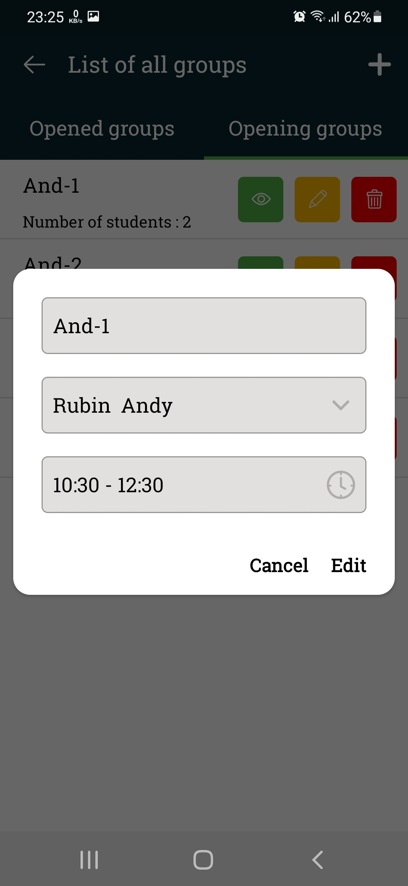
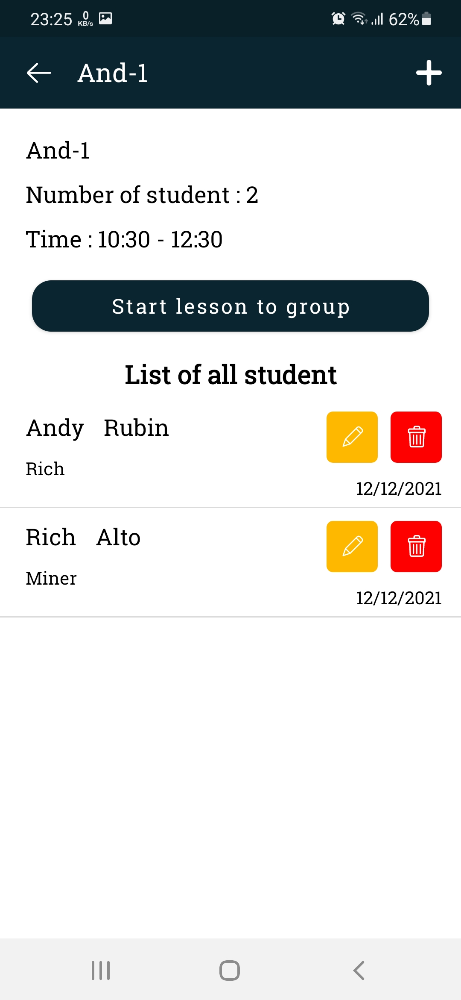
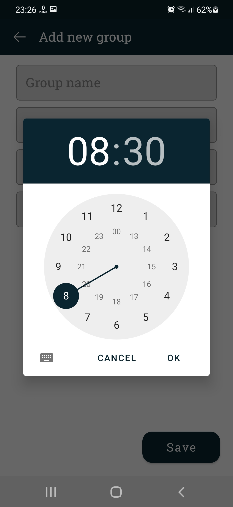
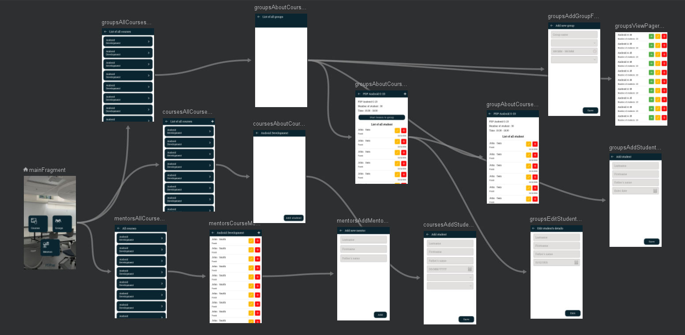

# Education Course System Management (with Room Database)
This application facilitates course system management. You can control mentors, groups, and courses. You can add courses, mentors, groups and students.

  
  
  
  
  
  

<h3>Navigation<h3>
   

  
